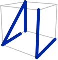

# alandella.github.io - Personal Academic Website


A **static personal website** — about page, blog, projects and publications — where every piece of copy lives in four YAML files at the root of this folder. There is no build step, no site generator, and no database: upload the folder to any static host and it runs.

Live at <https://alandella.github.io/>

---

## Logo

<div align="center">

</div>

## How it works

Each page is a plain HTML file wrapping an `<x-dc>` block, with a small `class Component extends DCLogic` script at the bottom. `support.js` — the DC runtime — compiles that markup into React in the browser at load time, resolving `{{ … }}` placeholders, `<sc-for>` loops, and `<dc-import>` component tags. Nothing is precompiled and there is no build output to keep in sync.

On load, every page calls `SiteData.ready()`, which fetches `site.yml`, hands its `theme:` block to `SiteTheme`, and only then reads the content file that page needs — `posts.yml`, `projects.yml`, or `publications.yml`. Entries are validated as they arrive: missing required fields and duplicate slugs are reported to the browser console rather than failing silently.

Colours come from one place. `site-theme.js` holds the palette and the light/dark/system engine; no page defines a colour of its own. The theme button in the nav cycles **system → light → dark** and remembers the choice in `localStorage`.

> [!WARNING]
> **The pages fetch their YAML over HTTP.** Opening `index.html` straight from disk with a `file://` URL leaves every page empty, because those `fetch()` calls are blocked. Serve the folder over HTTP instead — see [Local preview](#local-preview).

---

## Features

- **No build step**: edit a file, refresh the browser, done — no generator, no `npm install`
- **Content in YAML**: four files hold every word on the site; the HTML is pure layout
- **Markdown bodies**: headings, lists, tables, code fences, quotes, footnotes, figures, and `$math$`
- **Light / dark / system theme**: one palette in `site.yml`, applied across every page
- **Automatic contents list**: post and project pages build their own TOC from the headings in the body
- **Free-text search**: the blog and projects archives filter live across titles, summaries, and tags
- **Publication cards**: coloured journal chips, auto-bolded author name, expandable abstract and BibTeX
- **Selected entries**: `selected: true` promotes a post, project, or publication onto the about page
- **Drafts**: `draft: true` keeps a post in the file but off the site
- **Console diagnostics**: missing fields and duplicate slugs are named in the browser console
- **Shared nav and footer**: two `.dc.html` components imported by every page

---

## Installation

There is nothing to install and nothing to compile.

### 1. Clone the repository

```bash
git clone https://github.com/alandella/alandella.github.io.git
cd alandella.github.io
```

### 2. Serve it

```bash
python3 -m http.server 8000
```

Then visit <http://localhost:8000>.

---

## Quickstart

1. Serve the folder and open <http://localhost:8000>.
2. Open `site.yml` and replace the `owner:` block — name, role line, bio paragraphs.
3. Point the `links:` rows at your own profiles; blank a `url:` to hide that row.
4. Add an entry to `posts.yml`, `projects.yml`, or `publications.yml`.
5. Refresh. Keep the browser console open — that is where authoring mistakes are reported.

---

## Layout

### Pages

| File | What it is |
|---|---|
| `index.html` | About / home page — bio, socials, and the selected projects, publications and posts |
| `blog.html` | Blog archive, grouped by year, with a search box |
| `projects.html` | Projects archive, as a card grid with a search box |
| `publications.html` | Publications list, with abstract / BibTeX / DOI controls |
| `post.html#<slug>` | A single blog post |
| `project.html#<slug>` | A single project |

### Shared components

| File | What it is |
|---|---|
| `SiteNav.dc.html` | Nav bar: page links, scroll-spy underline, theme button |
| `SiteFooter.dc.html` | Footer: owner name, credit line, repo link |

> [!IMPORTANT]
> **Do not rename the `.dc.html` files.** A `<dc-import name="SiteNav">` tag is resolved by fetching `./SiteNav.dc.html` — the filename *is* the component name, and both files must sit next to the HTML pages.

### Shared code

| File | Responsibility |
|---|---|
| `support.js` | The DC runtime — compiles `<x-dc>` markup to React. Generated; do not edit by hand |
| `site-theme.js` | The colour palette and the light/dark/system engine, exposed as `window.SiteTheme` |
| `site-data.js` | YAML reader, markdown renderer, search helpers, and content validation, as `window.SiteData` |

### Content

| File | Holds |
|---|---|
| `site.yml` | Name, role, bio, social links, section blurbs, footer, colour palette |
| `posts.yml` | Every blog post, newest first |
| `projects.yml` | Every project |
| `publications.yml` | Every publication, newest first |

### Assets

| Path | Holds |
|---|---|
| `assets/logo.svg`, `assets/favicon.svg` | Site marks |
| `assets/cv.pdf`, `assets/cv-full.pdf` | The CVs linked from the about page |
| `assets/posts/`, `assets/projects/` | Images referenced from the YAML bodies |

`image:` paths are relative to this folder, e.g. `assets/posts/my-figure.png`. Leave the field empty and a dashed placeholder is drawn in its place.

---

## Editing content

### Adding a post

Add an entry at the top of `posts.yml`:

```yaml
- slug: rare-event-kinetics
  title: Simulating rare events in gas-phase kinetics
  date: 2026-03-15
  selected: true          # true = also on the about page
  draft: false            # true = hidden everywhere, kept in the file
  tags: [kinetics, simulation]
  summary: One-sentence standfirst.
  image: assets/posts/hero.png
  link:
  doi:
  body: |
    Opening paragraph.

    ## A subheading

    Body text, **bold**, a [link](https://example.com), and $E = mc^2$.
```

Every line under `body: |` must be indented by four spaces. Dates are `YYYY-MM-DD` and are shown as `15 mar 2026`; read time is estimated from the body at 200 words per minute.

### Markdown supported in bodies

| Syntax | Renders as |
|---|---|
| `##`, `###`, `####` | Headings — they also build the page's contents list |
| `**bold**`, `*italic*`, `` `code` `` | Inline emphasis and code |
| `[label](url)` | A link |
| `- item` / `1. item` | Bulleted and numbered lists |
| `> text` | Block quote |
| ` ```lang ` | Fenced code block |
| `\| a \| b \|` | Table, with a `\|---\|---\|` separator row under the header |
| `` | Figure with a caption; an empty path draws a placeholder |
| `[^1]` plus `[^1]: note` | Footnote, with its definition at the end of the body |
| `$x$`, `$$x$$` | Inline and display math, rendered by KaTeX |

### Slugs and links

Each entry in `posts.yml` and `projects.yml` needs a **unique `slug`**. That slug is the URL hash on the single-entry pages: `post.html#rare-event-kinetics`. Tag chips on a post link back to the archive as `blog.html#tag=<tag>`, which prefills the search box there.

> [!NOTE]
> An unknown slug is not an error page. `post.html#nope` falls back to the newest post and `project.html#nope` to the first project, each with a line explaining what happened.

### Publications

`publications.yml` carries the full record: authors, journal, volume, pages, DOI, abstract, and BibTeX. Three details are worth knowing:

- **Your surname is bolded automatically** wherever it appears in an author list. The match comes from `owner.surname` in `site.yml`.
- **`journal_color`** sets the small chip beside the entry (`"#B23A48"`, or a bare `B23A48`). Leave it empty to use the accent colour; the label flips between black and white so it stays legible on whatever colour you pick.
- **BibTeX is never generated.** The `BIB` button appears only once you paste an entry into that publication's `bibtex: |` field yourself.

The `ABS` and `BIB` buttons expand in place, and the `DOI` button copies the resolved DOI link to the clipboard while the title itself opens it.

### Search behaviour

The blog and projects archives share one search box. It matches titles, summaries and tags — **not** body text — and ignores queries shorter than three characters, so a stray keystroke does not empty the page. Clicking a tag chip drops that tag into the box; the `×` clears it.

---

## Configuration

All of it lives in `site.yml`.

| Block | Controls |
|---|---|
| `owner:` | Name, role line, the four bio paragraphs, and the caption under the profile mark |
| `repo:` | The repository link in the footer of every page |
| `credit:` | The credit line in the footer; leave empty to hide it |
| `links:` | The social icon rows on the about page |
| `blurbs:` | The one-line intro under each archive page's title |
| `theme:` | Colour overrides for light and dark |

### Changing the colours

Edit the `theme:` block. Any key you leave out falls back to the built-in palette in `site-theme.js`, so setting just `accent:` is perfectly fine.

| Key | Used for |
|---|---|
| `bg`, `text`, `muted` | Page background, body text, secondary text |
| `navBg` | The translucent nav bar background |
| `accent` | Links, the nav underline, the default journal chip |
| `divider`, `dash` | Rules between sections, dashed placeholder borders |
| `cardBg`, `codeBg` | Card and code-block backgrounds |
| `footerBg`, `footerText`, `footerLink` | The footer |

### Social links

Each row in `links:` is one clickable line: `icon` is a Font Awesome class, `title` is the tooltip, and `note` is the visible label beside the icon. An entry with an empty `url:` is left out entirely rather than rendered as a dead link, and `mailto:` links open in the same tab so no empty tab is left behind.

### The bio paragraphs

`bio`, `bio_2`, `bio_3`, and `bio_4` are rendered as inline markdown, so they can carry `[label](url)` links — that is how the CV links reach `assets/cv.pdf`. Any of them left empty is hidden rather than rendered as a blank paragraph. `name_light` is the trailing part of your name that the about page sets in a lighter weight.

---

## Local preview

The pages fetch YAML over HTTP, so a `file://` URL will not work. Serve the folder:

```bash
# Python
python3 -m http.server 8000

# Node
npx serve .
```

Then visit <http://localhost:8000>.

> [!TIP]
> Keep the browser console open while editing. Missing required fields and duplicate slugs are reported there by file and entry, e.g. `[posts.yml] duplicate slug "intro" — only the first entry is reachable at #intro.`

---

## Deployment

Push the contents of this folder to the repository root — or to `/docs`, and point Pages at it. Nothing needs building first.

GitHub Pages serves extensionless URLs, so `/blog` resolves to `blog.html`. The same folder works unchanged on Netlify, Cloudflare Pages, or a plain nginx root.

---

## Troubleshooting

| Symptom | Cause |
|---|---|
| Every page is empty | Opened over `file://` — serve the folder over HTTP instead |
| One entry is missing fields | YAML indentation; the console names the file and the entry |
| A `#slug` link lands on the wrong entry | Duplicate slug — only the first one is reachable |
| Nav or footer missing | A `.dc.html` file was renamed, or is not sitting next to the HTML pages |
| Math shows as plain text | KaTeX did not load; check the network tab |

The YAML reader is a **subset** of the format, not a full parser. Use spaces (never tabs), keep a space after each colon, and indent block bodies consistently.

---

## Dependencies

Nothing is installed or bundled. Four things load from CDNs at runtime:

| Dependency | Loaded by | Used for |
|---|---|---|
| React + ReactDOM 18.3.1 | `support.js`, from unpkg | The runtime the pages compile into |
| Babel Standalone 7.29.0 | `support.js`, from unpkg | Compiling each page's script in the browser |
| Font Awesome 6.5.2 | each page's `<helmet>` | The social and interface icons |
| KaTeX 0.16.9 | `post.html`, `project.html` | Math in post and project bodies |

Everything else — the pages, the runtime, the palette, the content — is served from this folder.

---

## Contributing

Pull requests are welcome.
For major changes, please open an issue first to discuss what you would like to change or add.

---

## License

Distributed under the **MIT License**. See the [`LICENSE`](LICENSE) file for details.

&copy; 2026 Andrea Giuseppe Landella
